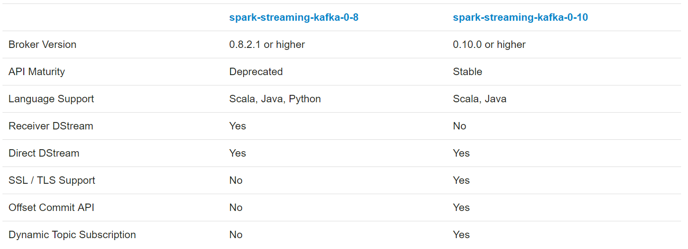

# Spark Streaming 2.4.4 对接 Kafka 0.8

[TOC]

[Spark Streaming + Kafka Integration Guide](https://spark.apache.org/docs/2.4.4/streaming-kafka-integration.html)

> Apache Kafka is publish-subscribe messaging rethought as a distributed, partitioned, replicated commit log service. Please read the Kafka documentation thoroughly before starting an integration using Spark.

> The Kafka project introduced a new consumer API between versions 0.8 and 0.10, so there are 2 separate corresponding Spark Streaming packages available. Please choose the correct package for your brokers and desired features; note that the 0.8 integration is compatible with later 0.9 and 0.10 brokers, but the 0.10 integration is not compatible with earlier brokers.

Kafka 在版本 0.8 和 0.10 ，引入了一个新的 consumer API，所以有2个独立的对应的 Spark Streaming 包可用。

注意：

- Kafka 0.8 兼容 0.9 和 0.10。但 0.10 不兼容更早版本的。
- Spark 2.3.0 对 Kafka 0.8 的支持被弃用。



所以在 `spark-streaming-kafka-0-10` 中仅支持 `Direct DStream` ，在 `	spark-streaming-kafka-0-8` 支持 `Direct DStream` 和 `Receiver DStream`

Spark Streaming 2.4.4 兼容 Kafka 0.8 及更高。

## 1、Spark Streaming + Kafka Integration Guide (Kafka broker version 0.8.2.1 or higher)

> Note: Kafka 0.8 support is deprecated as of Spark 2.3.0.

注意：Spark 2.3.0 不再支持 Kafka 0.8

> Here we explain how to configure Spark Streaming to receive data from Kafka. There are two approaches to this - the old approach using Receivers and Kafka’s high-level API, and a new approach (introduced in Spark 1.3) without using Receivers. They have different programming models, performance characteristics, and semantics guarantees, so read on for more details. Both approaches are considered stable APIs as of the current version of Spark.

有两种从 Kafka 接收数据的方法：

- 使用 Receivers 和 Kafka’s high-level API、

- Spark 1.3 引入的直连方式，不使用 Receivers。

### 1.1、Approach 1: Receiver-based Approach

> This approach uses a Receiver to receive the data. The Receiver is implemented using the Kafka high-level consumer API. As with all receivers, the data received from Kafka through a Receiver is stored in Spark executors, and then jobs launched by Spark Streaming processes the data.

Receiver 使用了 Kafka 高级消费者 API 实现的。**对于所有的 Receiver 从 Kafka 接收的数据都被存储在 Spark executors，Spark Streaming 启动的 jobs 来处理数据。**

> However, under default configuration, this approach can lose data under failures (see [receiver reliability](http://spark.apache.org/docs/2.4.4/streaming-programming-guide.html#receiver-reliability). To ensure zero-data loss, you have to additionally enable Write-Ahead Logs in Spark Streaming (introduced in Spark 1.2). This synchronously saves all the received Kafka data into write-ahead logs on a distributed file system (e.g HDFS), so that all the data can be recovered on failure. See [Deploying section](http://spark.apache.org/docs/2.4.4/streaming-programming-guide.html#deploying-applications) in the streaming programming guide for more details on Write-Ahead Logs.

然而，默认配置下，这个方法会**在故障时丢失数据。为避免这种情况，需要在 Spark Streaming 中启动 `Write-Ahead Logs`**。这会异步的将所有从 Kafka 接收到的数据存储到分布式文件系统的 `write-ahead logs` 中。【写入磁盘】

Deploying section 描述了如何更多的细节。

> Next, we discuss how to use this approach in your streaming application.

下面讨论如何使用这个方法：

> Linking: For Scala/Java applications using SBT/Maven project definitions, link your streaming application with the following artifact (see [Linking section](http://spark.apache.org/docs/2.4.4/streaming-programming-guide.html#linking) in the main programming guide for further information).

1.连接：对于 Scala/Java ，配置 artifact 。对于 Python ，添加库。

	 groupId = org.apache.spark
	 artifactId = spark-streaming-kafka-0-8_2.12
	 version = 2.4.4

> For Python applications, you will have to add this above library and its dependencies when deploying your application. See the Deploying subsection below.

> Programming: In the streaming application code, import KafkaUtils and create an input DStream as follows.

2.编程：导入 KafkaUtils，创建一个输入 DStream

**对于scala**

```scala
import org.apache.spark.streaming.kafka._

 val kafkaStream = KafkaUtils.createStream(streamingContext,
     [ZK quorum], [consumer group id], [per-topic number of Kafka partitions to consume])
```
> You can also specify the key and value classes and their corresponding decoder classes using variations of createStream. See the [API docs](http://spark.apache.org/docs/2.4.4/api/scala/index.html#org.apache.spark.streaming.kafka.KafkaUtils$).

**对于java**

```java
 import org.apache.spark.streaming.kafka.*;

 JavaPairReceiverInputDStream<String, String> kafkaStream =
     KafkaUtils.createStream(streamingContext,
     [ZK quorum], [consumer group id], [per-topic number of Kafka partitions to consume]);
```

> You can also specify the key and value classes and their corresponding decoder classes using variations of createStream. See the [API docs](http://spark.apache.org/docs/2.4.4/api/java/index.html?org/apache/spark/streaming/kafka/KafkaUtils.html)

**对于python**

```python
 from pyspark.streaming.kafka import KafkaUtils

 kafkaStream = KafkaUtils.createStream(streamingContext, \
     [ZK quorum], [consumer group id], [per-topic number of Kafka partitions to consume])
```
> By default, the Python API will decode Kafka data as UTF8 encoded strings. You can specify your custom decoding function to decode the byte arrays in Kafka records to any arbitrary data type. See the [API docs](http://spark.apache.org/docs/2.4.4/api/python/pyspark.streaming.html#pyspark.streaming.kafka.KafkaUtils).

> Points to remember:

注意以下几点：

> Topic partitions in Kafka do not correlate to partitions of RDDs generated in Spark Streaming. So increasing the number of topic-specific partitions in the KafkaUtils.createStream() only increases the number of threads using which topics that are consumed within a single receiver. It does not increase the parallelism of Spark in processing the data. Refer to the main document for more information on that.

- Kafka 中的 topic 分区并不对应于 Spark Streaming 中的 RDD 分区。所以，在一个 receiver 中，在 `KafkaUtils.createStream() ` 中增加分区数只会增加消费这个 topic 的线程数。并不会增加 Spark 处理数据的并行度。

> Multiple Kafka input DStreams can be created with different groups and topics for parallel receiving of data using multiple receivers.

- 可以使用多个 receivers 来并行接收数据。

> If you have enabled Write-Ahead Logs with a replicated file system like HDFS, the received data is already being replicated in the log. Hence, the storage level in storage level for the input stream to StorageLevel.MEMORY_AND_DISK_SER (that is, use KafkaUtils.createStream(..., StorageLevel.MEMORY_AND_DISK_SER)).

- 如果已经启动的 `Write-Ahead Logs`，那么接收的数据已经被复制到了文件中。因此存储级别设置为 `StorageLevel.MEMORY_AND_DISK_SER`

> Deploying: As with any Spark applications, spark-submit is used to launch your application. However, the details are slightly different for Scala/Java applications and Python applications.

3.部署：`spark-submit` 用来启动应用程序。但不同开发语言会有一些细节上的不同。

> For Scala and Java applications, if you are using SBT or Maven for project management, then package spark-streaming-kafka-0-8_2.12 and its dependencies into the application JAR. Make sure spark-core_2.12 and spark-streaming_2.12 are marked as provided dependencies as those are already present in a Spark installation. Then use spark-submit to launch your application (see Deploying section in the main programming guide).

对于 Scala and Java 应用程序，如果你使用了 SBT\Maven ，那么打包 `spark-streaming-kafka-0-8_2.12` 和它的依赖成 JAR。确保 `spark-core_2.12` 和 `spark-streaming_2.12` 标记为了 `provided`

> For Python applications which lack SBT/Maven project management, spark-streaming-kafka-0-8_2.12 and its dependencies can be directly added to spark-submit using --packages (see Application Submission Guide). That is,

对于 Pyhon，直接使用 `--packages` 添加到 `spark-submit`

```sh
./bin/spark-submit --packages org.apache.spark:spark-streaming-kafka-0-8_2.12:2.4.4 ...
```

也可以，从 Maven 下载 jar 后，使用`--jars`添加。

> Alternatively, you can also download the JAR of the Maven artifact spark-streaming-kafka-0-8-assembly from the Maven repository and add it to spark-submit with --jars.

### 1.2、Approach 2: Direct Approach (No Receivers)

> This new receiver-less “direct” approach has been introduced in Spark 1.3 to ensure stronger end-to-end guarantees. Instead of using receivers to receive data, this approach periodically queries Kafka for the latest offsets in each topic+partition, and accordingly defines the offset ranges to process in each batch. When the jobs to process the data are launched, Kafka’s simple consumer API is used to read the defined ranges of offsets from Kafka (similar to read files from a file system). Note that this feature was introduced in Spark 1.3 for the Scala and Java API, in Spark 1.4 for the Python API.

直连的方法会**周期地查询 Kafka 中每个 topic+partition 的最新偏移量，并据此，定义每个批次处理的偏移量范围。**

处理数据的 job 启动时，Kafka 的简单消费者 API 被用来读取 Kafka 中定义的一定范围的偏移量（类似于从文件系统读取文件）。

注意：对于 Scala and Java API ，这个特性是在 Spark 1.3 引入的。对于 Python API ，是在 Spark 1.4 引入的。

> This approach has the following advantages over the receiver-based approach (i.e. Approach 1).

相比方法1，该方法有以下优点：

> Simplified Parallelism: No need to create multiple input Kafka streams and union them. With directStream, Spark Streaming will create as many RDD partitions as there are Kafka partitions to consume, which will all read data from Kafka in parallel. So there is a one-to-one mapping between Kafka and RDD partitions, which is easier to understand and tune.

- 简化了并行度：不再需要创建多个输入 Kafka 流，再合并。而使用 `directStream` ，Spark Streaming 将创建与 Kafka 分区一样多的 RDD 分区，这些分区将并行地从 Kafka 读取数据。所以，在 Kafka 分区和 RDD 分区间存在一对一的对应关系。

> Efficiency: Achieving zero-data loss in the first approach required the data to be stored in a Write-Ahead Log, which further replicated the data. This is actually inefficient as the data effectively gets replicated twice - once by Kafka, and a second time by the Write-Ahead Log. This second approach eliminates the problem as there is no receiver, and hence no need for Write-Ahead Logs. As long as you have sufficient Kafka retention, messages can be recovered from Kafka.

- 高效：在方法1中实现无数据丢失，需要将数据存储在 `Write-Ahead Log` 中，这样数据就冗余了。这样是和复制两次一样低效，一次是 Kafka 复制，一次是 Write-Ahead Log 。只要有足够的 Kafka retention，消息可以从 Kafka 中恢复。

> Exactly-once semantics: The first approach uses Kafka’s high-level API to store consumed offsets in Zookeeper. This is traditionally the way to consume data from Kafka. While this approach (in combination with-write-ahead logs) can ensure zero data loss (i.e. at-least once semantics), there is a small chance some records may get consumed twice under some failures. This occurs because of inconsistencies between data reliably received by Spark Streaming and offsets tracked by Zookeeper. Hence, in this second approach, we use simple Kafka API that does not use Zookeeper. Offsets are tracked by Spark Streaming within its checkpoints. This eliminates inconsistencies between Spark Streaming and Zookeeper/Kafka, and so each record is received by Spark Streaming effectively exactly once despite failures. In order to achieve exactly-once semantics for output of your results, your output operation that saves the data to an external data store must be either idempotent, or an atomic transaction that saves results and offsets (see [Semantics of output operations](http://spark.apache.org/docs/2.4.4/streaming-programming-guide.html#semantics-of-output-operations) in the main programming guide for further information).

- Exactly-once 语义：方法1使用 Kafka 高级 API 在 Zookeeper 中存储消费的偏移量。这是传统的从 Kafka 消费数据的方法。当这个方法(启用了wal)确保无数据丢失时(如at-least once语义)，在某些故障下，记录就有可能被消费两次。这是因为 Spark Streaming 接收到的数据和 Zookeeper 追踪的偏移量不一致。所以，在方法2中，**使用简易 Kafka API，即不使用 Zookeeper。 Spark Streaming 使用 checkpoints 来追踪偏移量**。这就消除了 Spark Streaming 和 Zookeeper/Kafka 间的不一致性。所以 Spark Streaming 接收的数据即使在故障情况下也会只处理一次。为了实现输出结果的 exactly-once 语义，存储数据到外部存储介质的操作必须要么是幂等的，要么是存储结果和偏移量的原子的事务操作。

> Note that one disadvantage of this approach is that it does not update offsets in Zookeeper, hence Zookeeper-based Kafka monitoring tools will not show progress. However, you can access the offsets processed by this approach in each batch and update Zookeeper yourself (see below).

注意：这个方法的缺点就是不会在 Zookeeper 中更新偏移量，因此基于 Zookeeper 的 Kafka 监控工具不会展示进度。但是，可以访问到每个批次中方法处理的偏移量，自己更新 Zookeeper。

*Next, we discuss how to use this approach in your streaming application.*

> 1.Linking: This approach is supported only in Scala/Java application. Link your SBT/Maven project with the following artifact (see Linking section in the main programming guide for further information).

	 groupId = org.apache.spark
	 artifactId = spark-streaming-kafka-0-8_2.12
	 version = 2.4.4

> 2.Programming: In the streaming application code, import KafkaUtils and create an input DStream as follows.

**对于scala**

```scala
 import org.apache.spark.streaming.kafka._

 val directKafkaStream = KafkaUtils.createDirectStream[
     [key class], [value class], [key decoder class], [value decoder class] ](
     streamingContext, [map of Kafka parameters], [set of topics to consume])
```
> You can also pass a messageHandler to createDirectStream to access MessageAndMetadata that contains metadata about the current message and transform it to any desired type. See the [API docs](http://spark.apache.org/docs/2.4.4/api/scala/index.html#org.apache.spark.streaming.kafka.KafkaUtils$).

可以添加参数 messageHandler 可以获取 MessageAndMetadata ，它包含了关于当前信息的元数据，转换它成任意类型。

**对于java**

```java
import org.apache.spark.streaming.kafka.*;

 JavaPairInputDStream<String, String> directKafkaStream =
     KafkaUtils.createDirectStream(streamingContext,
         [key class], [value class], [key decoder class], [value decoder class],
         [map of Kafka parameters], [set of topics to consume]);
```

> You can also pass a messageHandler to createDirectStream to access MessageAndMetadata that contains metadata about the current message and transform it to any desired type. See the [API docs](http://spark.apache.org/docs/2.4.4/api/java/index.html?org/apache/spark/streaming/kafka/KafkaUtils.html).

**对于python**

```python
from pyspark.streaming.kafka import KafkaUtils
 directKafkaStream = KafkaUtils.createDirectStream(ssc, [topic], {"metadata.broker.list": brokers})
```
> You can also pass a messageHandler to createDirectStream to access KafkaMessageAndMetadata that contains metadata about the current message and transform it to any desired type. By default, the Python API will decode Kafka data as UTF8 encoded strings. You can specify your custom decoding function to decode the byte arrays in Kafka records to any arbitrary data type. See the [API docs](http://spark.apache.org/docs/2.4.4/api/python/pyspark.streaming.html#pyspark.streaming.kafka.KafkaUtils).

> In the Kafka parameters, you must specify either metadata.broker.list or bootstrap.servers. By default, it will start consuming from the latest offset of each Kafka partition. If you set configuration auto.offset.reset in Kafka parameters to smallest, then it will start consuming from the smallest offset.

关于 Kafka 的参数，要么指定 `metadata.broker.list`，要么指定`bootstrap.servers`。默认情况下，将从每个分区的最新偏移处开始消费。

如果设置了 `auto.offset.reset` 为 smallest，那么就会从最小偏移量处开始消费。

> You can also start consuming from any arbitrary offset using other variations of KafkaUtils.createDirectStream. Furthermore, if you want to access the Kafka offsets consumed in each batch, you can do the following.

你也可以使用 `KafkaUtils.createDirectStream` 的变体从任意偏移量处开始消费。

如果你想访问每个批次中消费的 Kafka 偏移量，你可以这么做：

**对于scala**

```scala
// Hold a reference to the current offset ranges, so it can be used downstream
 var offsetRanges = Array.empty[OffsetRange]

 directKafkaStream.transform { rdd =>
   offsetRanges = rdd.asInstanceOf[HasOffsetRanges].offsetRanges
   rdd
 }.map {
           ...
 }.foreachRDD { rdd =>
   for (o <- offsetRanges) {
     println(s"${o.topic} ${o.partition} ${o.fromOffset} ${o.untilOffset}")
   }
   ...
 }
```

**对于java**

```java
// Hold a reference to the current offset ranges, so it can be used downstream
 AtomicReference<OffsetRange[]> offsetRanges = new AtomicReference<>();

 directKafkaStream.transformToPair(rdd -> {    OffsetRange[] offsets = ((HasOffsetRanges) rdd.rdd()).offsetRanges();    offsetRanges.set(offsets);    return rdd;
 }).map(
   ...
 ).foreachRDD(rdd -> {    for (OffsetRange o : offsetRanges.get()) {
 System.out.println(
   o.topic() + " " + o.partition() + " " + o.fromOffset() + " " + o.untilOffset()
 );    }    ...
 });
```

**对于python**

```python
offsetRanges = []

 def storeOffsetRanges(rdd):
     global offsetRanges
     offsetRanges = rdd.offsetRanges()
     return rdd

 def printOffsetRanges(rdd):
     for o in offsetRanges:
         print "%s %s %s %s" % (o.topic, o.partition, o.fromOffset, o.untilOffset)

 directKafkaStream \
     .transform(storeOffsetRanges) \
     .foreachRDD(printOffsetRanges)
```
> You can use this to update Zookeeper yourself if you want Zookeeper-based Kafka monitoring tools to show progress of the streaming application.

你可以使用这个来更新 Zookeeper。

> Note that the typecast to HasOffsetRanges will only succeed if it is done in the first method called on the directKafkaStream, not later down a chain of methods. You can use transform() instead of foreachRDD() as your first method call in order to access offsets, then call further Spark methods. However, be aware that the one-to-one mapping between RDD partition and Kafka partition does not remain after any methods that shuffle or repartition, e.g. reduceByKey() or window().

注意：只有在 directKafkaStream 的结果上调用第一个方法完成后，类型才能转换为 HasOffsetRanges ，而不是在后面的一系列方法之后。

为了访问偏移量，可以使用 transform() 作为你的第一个方法，而不是 foreachRDD()。然后进一步调用 Spark 方法。

在执行 shuffle 或分区的方法(reduceByKey() or window())执行完后，RDD 分区和 Kafka 分区就不再一对一映射。

> Another thing to note is that since this approach does not use Receivers, the standard receiver-related (that is, configurations of the form spark.streaming.receiver.* ) will not apply to the input DStreams created by this approach (will apply to other input DStreams though). Instead, use the configurations `spark.streaming.kafka.*`.An important one is spark.streaming.kafka.maxRatePerPartition which is the maximum rate (in messages per second) at which each Kafka partition will be read by this direct API.

`spark.streaming.receiver.*` 这种形式的配置将不会应用到输入 DStreams 上，而是使用 `spark.streaming.kafka.*`

> 3.Deploying: This is same as the first approach.